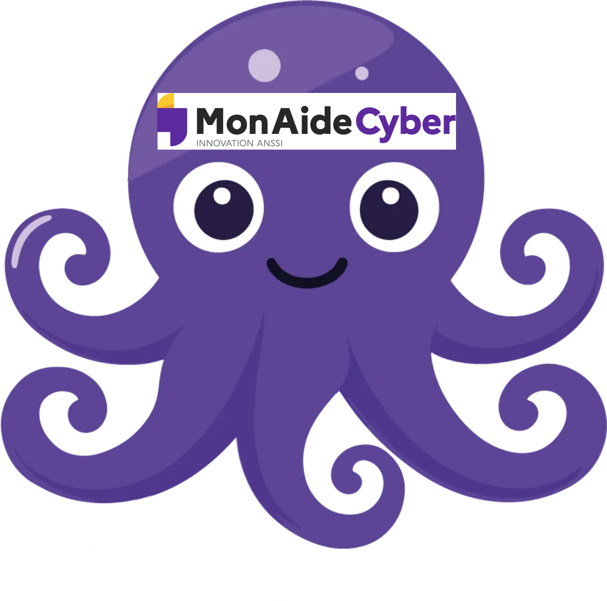

# CA-mac

Le but de ce projet est d'intégrer le questionnaire et les mesures MonAideCyber (https://monaide.cyber.gouv.fr/) dans Ciso-Assistant (https://intuitem.gitbook.io/ciso-assistant)

Le questionnaire MonAideCyber (https://monaide.cyber.gouv.fr/diagnostic-libre-acces) est dans l'onglet mac13.xlsx/requirements_content. Les questions se concentrent sur le cas général des PME non industrielles c'est pourquoi les questions 4, 7, 10, 20, 21, 22 et 26 ont été volontairement simplifiées.

Les mesures (ref_controls) ont été directement récupérées sur le dépôt officiel : https://github.com/betagouv/mon-aide-cyber. 

Le référentiel ciso assistant v1 est    
Le référentiel ciso assistant v2 est   

A chaque question correspond en général une mesure mac13.xlsx/reference_controls_content. 
Le lien entre les questions et les mesures se fait avec la colonne mac13.xlsx/reference_controls_content/ref_id .
Chaque mesure à une priorité assignée par l'ANSSI. J'ai mis cette information à la fin de la mesure : P<priorité_1_a_36>
